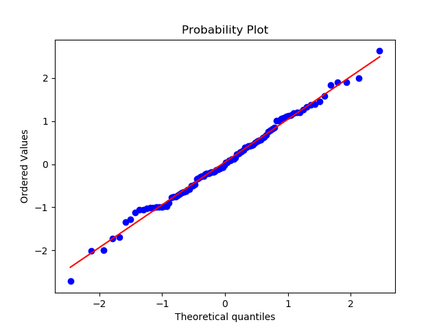

# Probplot

## 1. Q-Q plot (quantile quantile plot)
Describe the relationship between two distributions.
 
Terms:
- CDF : cumulative density function.
- PPF : percent point function (inverse of cdf function).

How Q-Q plot works:

1. Assume we have CDF of two distributions:
    - target distribution `t`
    - sample distribution `s`
    

    Cumulative distributions functions are obviously monotonic.
    Now we would like to know the relation between `a_t` and `a_s`.

    $F (a_s) = t^{-1} ( s (a_s)) = a_t$

    in the haskell notation 
    $F = t^{-1} . s$

    In this case, if `t` $\equiv$ `s`, then function $F = id$, therefore function $F$ will be a $45\degree$ line.
2. How to plot target distribution against sample distrition.
   - sort sample data.          `d_s = sort d_s`
   - get quantile list of sorted sample data    `p_s = uniform_plot d_s`
   - compute ppf of target distribution againest given quantile list. `a_t = target.dist.ppf(p_s)`  which is also equvilent to `a_t= `$t^{-1}$ `p_s`
   - draw `R(a_t)` and `R(a_s)` accordingly.

   `uniform_plot` return the quantile of sorted sample data, it could be as simple as:
    > `betaMean nobs = (\x-> x / (nobs+1)) <$> [1.0..nobs]`    
    > the same as [plotting_pos](https://github.com/statsmodels/statsmodels/blob/66fc298c51dc323ce8ab8564b07b1b3797108dad/statsmodels/graphics/gofplots.py#L639)     
    > and [beta.mean](https://github.com/scipy/scipy/blob/v1.3.0/scipy/stats/morestats.py#L393)

   or we could be more acution, use:
   > [beta.median or Filliben approximation](https://github.com/scipy/scipy/blob/v1.3.0/scipy/stats/morestats.py#L398-L413)

    `R` represent different form of `a_t` and `a_s`.   
    > - `a_t`, `a_s` refere to normalized rescaled data set.
    > - `R (a_s) ` could give back the original dataset: usually for `sample dataset`
    > - `R (a_t) ` could give back standard deviation, such as in scipy.probplot.

3. How to plot the reference line
   
   least-squre regression

4. work flow summary:
5. 

### References
- package: scipy
    ```
    >>> from scipy import stats
    >>> import matplotlib.pyplot as plt
    ```
    
    >example One
    > ```
    > >>> x = stats.t.rvs(25,size=nsample)
    > >>> res = stats.probplot(x,plot=plt)
    > >>> plt.show()
    > ```
    
    
    >example two
    >```
    >>>> x = stats.norm.rvs(loc=[0,5], scale=[1,1.5],size=(nsample//2,2)).ravel()
    >>>> res = stats.probplot(x,plot=plt)
    >>>> plt.show()
    >```
    
    
- package: statsmodels
    ```
    import statsmodels.api as sm
    import statsmodels.formula.api as smf
    ```